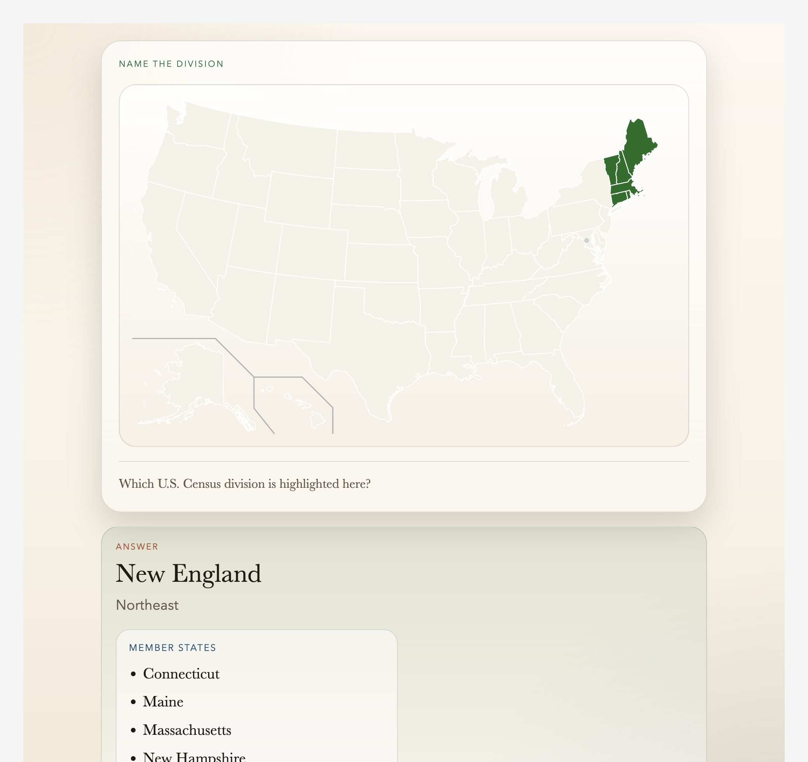

# us-regions

[](https://github.com/elvis-sik/us-regions/actions/workflows/anki-workbench.yml)
[](https://ankiweb.net/shared/info/778756695)

[](LICENSE)

An Anki deck generator for the U.S. Census Bureau's four regions and nine divisions, with map-based cards for regions, divisions, and member states.



## Download

Install the shared deck from [AnkiWeb](https://ankiweb.net/shared/info/778756695).

## What this repo builds

The deck teaches the standard Census hierarchy:

- Regions: `Northeast`, `Midwest`, `South`, `West`
- Divisions: `New England`, `Mid-Atlantic`, `East North Central`, `West North Central`, `South Atlantic`, `East South Central`, `West South Central`, `Mountain`, `Pacific`

Working scope for this project:

- use the Census Bureau's four regions and nine divisions as the canonical hierarchy
- include the District of Columbia with `South Atlantic`
- exclude Puerto Rico and other U.S. territories from the core deck because they are not assigned to a Census region or division in the source hierarchy used here

## Card set

Region cards:

1. Region -> neighboring regions / countries / oceans
2. Region + blank map -> locator map
3. Locator map -> region name
4. Region -> divisions

Division cards:

1. Division -> region
2. Division -> neighboring divisions / countries / oceans
3. Division + blank map -> locator map
4. Locator map -> division name
5. Division -> states
6. Division -> per-state border summary

Visual answer support includes:

- locator maps for every region and division
- unlabeled region-division membership maps
- unlabeled division-state membership maps

## Repository layout

- [`data/raw/us_regions_notes_seed.csv`](data/raw/us_regions_notes_seed.csv): seeded region notes
- [`data/raw/us_divisions_notes_seed.csv`](data/raw/us_divisions_notes_seed.csv): seeded division notes
- [`data/raw/us_map_asset_sources.csv`](data/raw/us_map_asset_sources.csv): map-source manifest
- [`data/raw/us_state_border_reference.csv`](data/raw/us_state_border_reference.csv): reusable state adjacency reference
- [`scripts/fetch_map_assets.py`](scripts/fetch_map_assets.py): downloads shared source maps
- [`scripts/generate_locator_maps.py`](scripts/generate_locator_maps.py): generates locator and membership SVGs
- [`scripts/populate_division_border_summaries.py`](scripts/populate_division_border_summaries.py): fills division state-border summaries
- [`scripts/build_apkg.py`](scripts/build_apkg.py): builds the Anki package
- [`REGION_NOTE_TYPE.md`](REGION_NOTE_TYPE.md): region note contract
- [`DIVISION_NOTE_TYPE.md`](DIVISION_NOTE_TYPE.md): division note contract
- [`US_REGIONS_DECK_PLAN.md`](US_REGIONS_DECK_PLAN.md): planning notes and modeling decisions

## Data and media model

The project uses one shared blank U.S. SVG as the canonical base map and derives the rest of the visual assets programmatically:

- region locator maps
- division locator maps
- region division-membership maps
- division state-membership maps

That keeps the visual style consistent and makes the deck reproducible from the source CSVs instead of depending on a pile of manually edited image files.

## Build

Install dependencies:

```sh
uv sync --extra deck
```

Fetch source maps:

```sh
.venv/bin/python scripts/fetch_map_assets.py
```

Generate locator and membership SVGs:

```sh
.venv/bin/python scripts/generate_locator_maps.py
```

Populate division state-border summaries:

```sh
.venv/bin/python scripts/populate_division_border_summaries.py
```

Build the Anki package:

```sh
.venv/bin/python scripts/build_apkg.py
```

Output:

- `out/us-regions.apkg`

## Sources

Primary reference:

- [List of regions of the United States](https://en.wikipedia.org/wiki/List_of_regions_of_the_United_States)

Map provenance is documented in [`data/raw/us_map_asset_sources.csv`](data/raw/us_map_asset_sources.csv).

## License

Repository code and documentation are MIT licensed. Source maps and reference data keep their upstream licenses and attribution requirements as documented in the data manifests.
